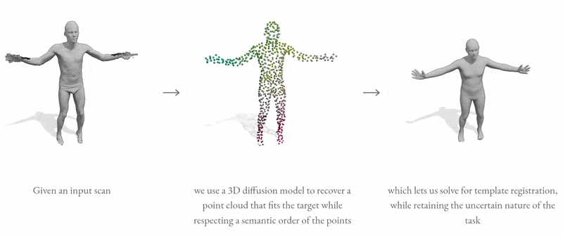

<!-- HEADER -->
<h1 align="center">ODin: Ordered Diffusion for 3D Human Registration</h1>

<p align="center">
  <b>Mattia Masiero</b>
  &emsp;
  <a href="https://ptrvilya.github.io/"><b>Ilya A. Petrov</b></a>
  &emsp;
  <a href="https://cvg.cit.tum.de/members/cremers"><b>Daniel Cremers</b></a>
  &emsp;
  <a href="https://virtualhumans.mpi-inf.mpg.de/people/pons-moll.html"><b>Gerard Pons-Moll</b></a>
  &emsp;
  <a href="https://riccardomarin.github.io"><b>Riccardo Marin</b></a>
</p>



Code for *Ordered Diffusion for 3D Human Registration*, accepted at GCPR 2026 (Oral). [[arXiv](https://arxiv.org/abs/2608.05804v1)] [[Project Page](https://riccardomarin.github.io/odin/)]

## Installation
The code was tested under ```Ubuntu 24.04, Python 3.11, PyTorch 2.3.1, CUDA 11.8```. 

### 1. Install System Dependencies (gcc & g++ ≤ 11)

```bash
sudo apt update
sudo apt install gcc-11 g++-11

# if default gcc/g++ is > 11:
export CC=/usr/bin/gcc-11
export CXX=/usr/bin/g++-11
export CUDAHOSTCXX=/usr/bin/g++-11
```

### 2. Create Conda Environment

```bash
conda env create -f environment.yml
conda activate odin
```

### 3. Install VPoser
```bash
pip install --no-deps "git+https://github.com/nghorbani/human_body_prior.git@78c86eae5ed518ae22bf197fd74211bbfa45551a"
```

### 4. Install smplfitter
```
pip install git+https://github.com/Matti-Prog/smplfitter.git@custom-v0.4.1
```

## Helper Files

### VPoser Weights
Download VPoser checkpoint v2.0 from the SMPL-X project page https://smpl-x.is.tuebingen.mpg.de/ and place the folder ```V02_05``` into ```assets/vposer```.

### Body Models
We use different SMPL variants for out-of-the-box compatibility with the methods integrated into our pipeline:
- **SMPL:** Download the model from [SMPL](https://smpl.is.tue.mpg.de/). Note that `SMPL_NEUTRAL.pkl` and `basicmodel_neutral_lbs_10_207_0_v1.1.0.pkl` are the same model, renamed.
- **SMPL-H:** Download the model from [MANO](https://mano.is.tue.mpg.de/) and follow the provided instructions to merge the SMPL and MANO models into SMPL-H.

Place the downloaded body models in ```support_data/body_models``` according to the following directory structure:
```
support_data
└── body_models
    ├── smpl
    │   └── SMPL_NEUTRAL.pkl
    ├── smplh
    │   ├── SMPLH_FEMALE.pkl
    │   ├── SMPLH_MALE.pkl
    │   └── SMPLH_NEUTRAL.pkl
    └── smpl_smplfitter
        └── basicmodel_neutral_lbs_10_207_0_v1.1.0.pkl
```

## Dataset Preprocessing
In ```data_preprocessing```, you can find the preprocessing code for each dataset, controlled by the corresponding YAML configuration file.

## Main Code
The configuration is defined in ```odin/config/structured.py```. For the dataset you want to use, set its root path to the dataset generated by the corresponding preprocessing script.
The documentation in ```odin/config/structured.py``` provides a detailed reference for required paths, dataset options, training, inference, and SMPL-fitting settings.

### Inference

```python odin/main.py run.job=sample checkpoint.resume="path_to_checkpoint.pth" dataset=amass run.name=sample__amass```

### Training
```python odin/main.py dataset=amass run.name=train__amass```

## Citation

```bibtex
@inproceedings{masiero2026odin,
  author    = {Masiero, Mattia and Petrov, Ilya A. and Cremers, Daniel
               and Pons-Moll, Gerard and Marin, Riccardo},
  title     = {Ordered Diffusion for {3D} Human Registration},
  booktitle = {DAGM German Conference on Pattern Recognition},
  publisher = {Springer},
  year      = {2026},
}
```

## Acknowledgements
We thank the authors of the following open-source projects, which provided valuable resources for developing this work:

- [PC^2](https://github.com/lukemelas/projection-conditioned-point-cloud-diffusion): diffusion implementation
- [SMPL-X](https://github.com/vchoutas/smplx): body-model utilities
- [FAUST](https://faust-leaderboard.is.tuebingen.mpg.de/), [DFAUST](https://dfaust.is.tue.mpg.de/), and [AMASS](https://amass.is.tue.mpg.de/): datasets and data-processing code
- [PointNet++](https://github.com/yanx27/Pointnet_Pointnet2_pytorch): point-cloud feature extractor implementation
- [TriDi](https://github.com/ptrvilya/tridi): denoiser transformer implementation
- [smplfitter](https://github.com/isarandi/smplfitter): SMPL fitting
- [NICP](https://github.com/riccardomarin/NICP): SMPL fitting
- [VPoser](https://github.com/nghorbani/human_body_prior): body-pose regularization
